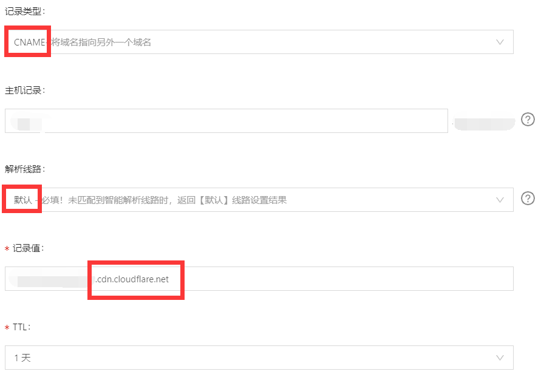
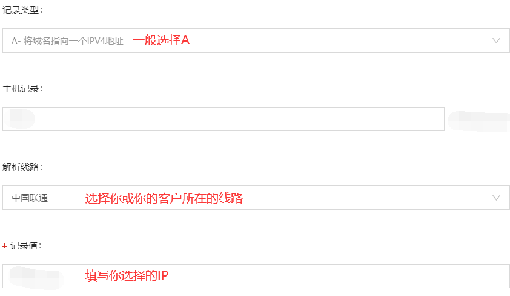
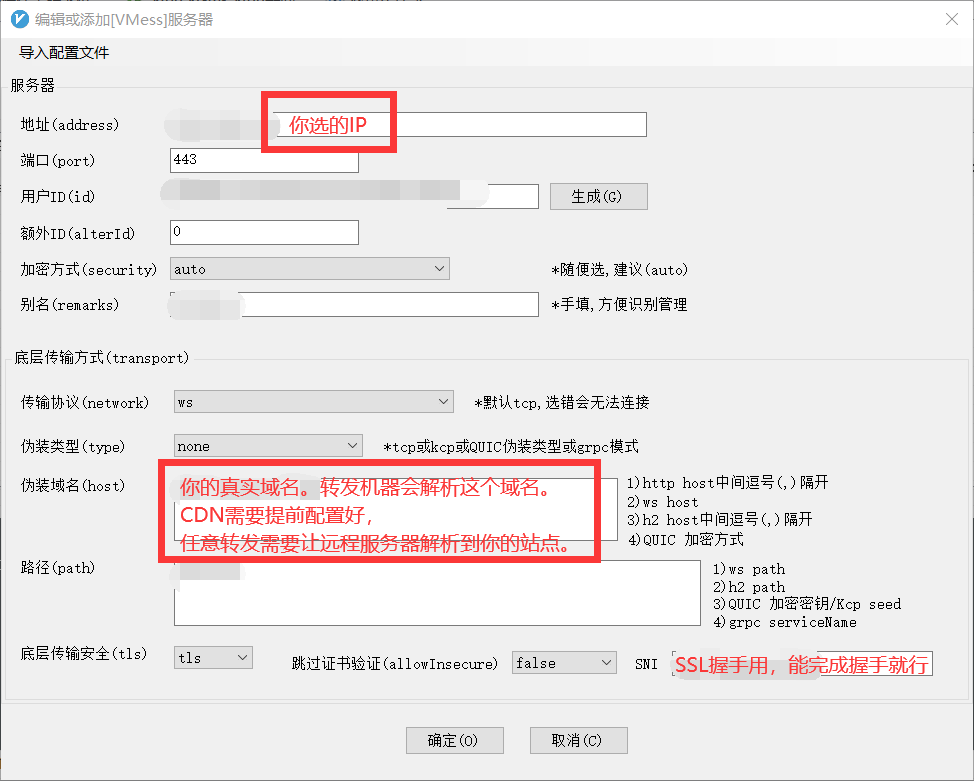

# 食用教程

## 这玩意是啥

这玩意是由热心网友所扫描出来转发Cloudflare IP的。这里统计了所扫描到有效的IP，不保证稳定性及可用性，仅保证他在我们扫描的时候他转发了Cloudflare。
**部分IP为转发0.0.0.0:443 不单单包含Cloudflare**

## 1.普通网站食用教程

**首先确保您的网站不是Cloudflare NS接入，若是，可直接跳过该部分**

从我们的列表中选择出一个您觉得速度和稳定性都相对较好的。

然后打开您的网站域名解析后台，选择到您用于建站的域名，将原有的解析结果更换为A类型+您所选的IP。

--------

*下面以阿里云解析做例子:*

对于默认和境外线路，一定要填写 Cloudflare 给你的解析(给Cloudflare看的)。

选择转发任意域名的服务器的，填写真实情况给转发机看。

--------

对于你或你的客户所在的线路，可以酌情考虑设置解析到相应服务器上。

*对于转发任意域名的节点，该地址不应被转发服务器看到。(会造成反代自己的回环)*

更改完解析后，通常您的站已经可以访问了，并且速度很快。

----

## 2.基于HOST/SNI伪装的代理软件

**关于节点套Cloudflare可以先参考这个视频 https://www.youtube.com/watch?v=80rBGZWYlxw**

如果您按照上述视频套完了Cloudflare,且测试没问题，那么可以进行下一步。

*打开您的代理软件，这里使用V2rayN演示:*

不出意外，改完之后您的代理应该已经能跑起来了。

----------
**教程先写到这里，欢迎各位补充更多玩法及建议。**

